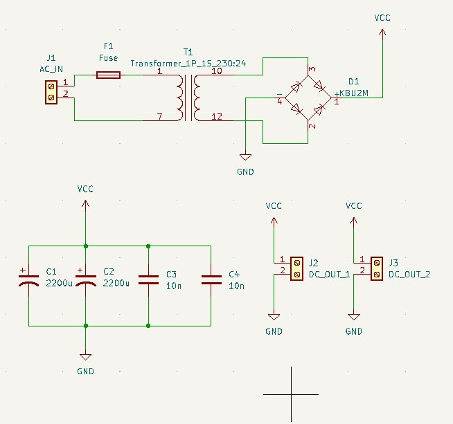
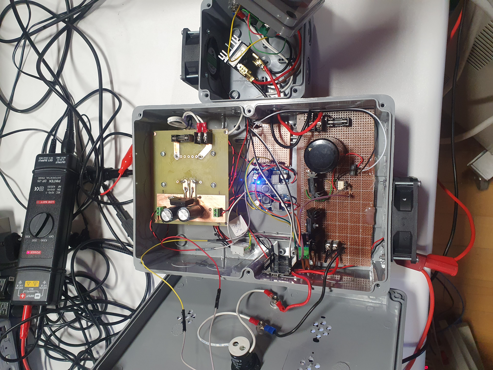

# EE463 2022 Term Project
2 kW Smart DC motor drive.

# Circuit Diagrams

## Main Block Diagram

## Main Buck Converter

## Low Power Adapter
### Schematic

 

### PCB

 

#### Top

#### Bottom

# Device

 

## Top

## Side

## In

## Line to Neutral

## In [Wide Angle]

# Analysis
## Power
### Rated Voltage [Loaded]

 

### Rated Power [Loaded]

 

## Waveforms

### Unloaded @v 25 % Duty

 

## Thermals

### IGBT

 

### 3 Phase Diode Rectifier

# Miscellaneous Demos
 ## Webserver Demo
 Webdemo could be seen via following the link below:

  https://medogan.com/test_server_demo/463_esp_webdemo.html
## IP Scanning

## Controller

# Demo Videos

 ## Motor Lab Demo
 https://www.youtube.com/watch?v=8uU4kF-YDas

 ## Motor Lab Demo [ WebGui]
 https://www.youtube.com/watch?v=bq63kfShjrk

 ## ESP Soft Starting Demo
 https://www.youtube.com/watch?v=6NDupYknA6s

 ## Optocoupler Demo
https://www.youtube.com/watch?v=Q2luOk-gndQ

 ## Testing IRFP460 N Channel MOSFET
  https://www.youtube.com/watch?v=HJyMbZKjLFo
  
 IRFP460 was not used in the project because it is not supplied by the University and its is expensive and we've left only one. [We had 2 but we burned one of them.]
 IXGH24N60C4D1 N Channel IGBT was used due to it is supplied by the University .